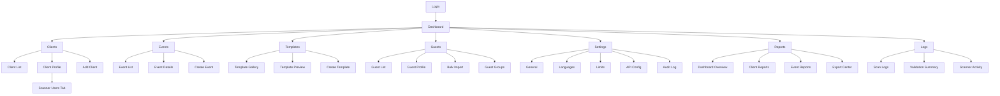

# Phase 1: Admin Dashboard Design & Structure

## Centralized Digital Invitation & QR Verification Platform

---

## 1. System Overview

A multi-tenant, enterprise-grade admin dashboard for managing digital invitations, QR verification, clients, events, and guests. The system supports **Arabic (RTL)** and **English (LTR)** with role-based access control.

---

## 2. Dashboard Layout Design

### 2.1 Layout Structure

```
┌──────────────────────────────────────────────────────────────────┐
│                        TOP HEADER BAR                            │
│  [Logo]              [Language Switch]  [Notifications] [User ▼] │
├────────────────┬─────────────────────────────────────────────────┤
│                │                                                 │
│   SIDE         │              MAIN CONTENT AREA                  │
│   NAVIGATION   │                                                 │
│   BAR          │   ┌─────────────────────────────────────────┐  │
│                │   │  Breadcrumb / Page Title                │  │
│   - Dashboard  │   ├─────────────────────────────────────────┤  │
│   - Clients    │   │                                         │  │
│   - Events     │   │        Dynamic Content Area             │  │
│   - Templates  │   │                                         │  │
│   - Guests     │   │        (Tables, Forms, Cards,           │  │
│   - Settings   │   │         Analytics, etc.)                │  │
│   - Reports    │   │                                         │  │
│   - Logs       │   └─────────────────────────────────────────┘  │
│                │                                                 │
└────────────────┴─────────────────────────────────────────────────┘
```

### 2.2 Component Specifications

| Component | Description |
|-----------|-------------|
| **Top Header** | Fixed height (64px), spans full width, contains logo, language toggle, notification bell, user profile dropdown |
| **Side Navigation** | Fixed width (260px expanded, 72px collapsed), collapsible, sticky position |
| **Main Content** | Fluid width, scrollable, padding 24px, max-width 1440px centered |

### 2.3 RTL vs LTR Behavior

| Element | LTR (English) | RTL (Arabic) |
|---------|---------------|--------------|
| **Side Navigation** | Left side | Right side |
| **Logo Position** | Left in header | Right in header |
| **User Menu** | Right in header | Left in header |
| **Text Alignment** | Left-aligned | Right-aligned |
| **Icons with Text** | Icon → Text | Text ← Icon |
| **Navigation Arrows** | `>` for expand | `<` for expand |
| **Tables** | Left-to-right columns | Right-to-left columns |
| **Form Labels** | Above/left of inputs | Above/right of inputs |

### 2.4 Responsive Behavior (Desktop First)

| Breakpoint | Behavior |
|------------|----------|
| **≥1440px** | Full layout, expanded sidebar |
| **1024-1439px** | Collapsible sidebar (icons only by default) |
| **768-1023px** | Hamburger menu, overlay sidebar |
| **<768px** | Mobile view with bottom navigation (stretch goal) |

---

## 3. User Roles & Permissions

### 3.1 Role Definitions

#### Super Admin
> System owner with full access to all features and settings

| Capability | Description |
|------------|-------------|
| **Access Level** | All sections, all tenants |
| **User Management** | Create/edit/delete all users including other admins |
| **System Configuration** | Modify global settings, limits, channels |
| **Data Access** | View/export all client and event data |
| **Client Management** | Full CRUD operations |
| **Template Management** | Create/edit/delete all templates |
| **Billing/Limits** | Configure subscription limits per client |

#### Admin User
> Operational staff with limited administrative capabilities

| Capability | Description |
|------------|-------------|
| **Access Level** | Assigned sections only |
| **User Management** | View users, cannot modify roles |
| **Client Management** | View/edit clients (no delete) |
| **Event Management** | Full CRUD for events |
| **Guest Management** | Full CRUD for guests |
| **Templates** | Use existing templates, no creation |
| **Reports** | Generate and view reports |
| **Settings** | No access to system settings |

#### Report Viewer (Read-Only)
> Auditors or stakeholders needing visibility without edit access

| Capability | Description |
|------------|-------------|
| **Access Level** | Reports, Analytics, Logs only |
| **Actions** | View and export only |
| **No Write Access** | Cannot create, edit, or delete any records |
| **Dashboard** | Read-only analytics view |

### 3.2 Role vs Permission Matrix

| Section | Super Admin | Admin User | Report Viewer |
|---------|:-----------:|:----------:|:-------------:|
| **Dashboard Overview** | ✅ Full | ✅ Full | ✅ View Only |
| **User Management** | ✅ Full CRUD | 👁️ View Only | ❌ No Access |
| **Client Management** | ✅ Full CRUD | ✏️ View/Edit | ❌ No Access |
| **Scanner Users** | ✅ Full CRUD | ✅ Full CRUD | ❌ No Access |
| **Event Management** | ✅ Full CRUD | ✅ Full CRUD | 👁️ View Only |
| **Template Builder** | ✅ Full CRUD | 👁️ View/Use | ❌ No Access |
| **Guest Management** | ✅ Full CRUD | ✅ Full CRUD | 👁️ View Only |
| **Invitation Settings** | ✅ Full | ✏️ Edit | ❌ No Access |
| **QR & Validation Logs** | ✅ View/Export | ✅ View/Export | ✅ View/Export |
| **Reports & Analytics** | ✅ Full | ✅ View/Generate | ✅ View Only |
| **System Settings** | ✅ Full | ❌ No Access | ❌ No Access |

**Legend:** ✅ Full Access | ✏️ Limited Edit | 👁️ View Only | ❌ No Access

---

## 4. Dashboard Sections

### 4.1 Authentication & User Management

> **Purpose:** Manage system users, roles, and authentication

#### Screens

| Screen | Description |
|--------|-------------|
| **Login** | Email/password login, language selector, forgot password link |
| **Forgot Password** | Email input for password reset |
| **Reset Password** | New password form with confirmation |
| **User List** | Paginated table of all users with role badges |
| **User Details** | View/edit individual user profile |
| **Add User** | Form to create new user with role assignment |
| **Activity Log** | User login history and actions |

#### Key Actions
- Login/Logout
- Create new user (Super Admin only)
- Assign/change user role
- Deactivate/reactivate user
- Reset user password
- View user activity history

---

### 4.2 Client Management

> **Purpose:** Manage business clients (tenants) subscribing to the platform

#### Screens

| Screen | Description |
|--------|-------------|
| **Client List** | Searchable table with filters (status, subscription tier) |
| **Client Profile** | Full client details with tabs: Overview, Events, Scanner Users, Subscription |
| **Add Client** | Multi-step form for onboarding new client |
| **Edit Client** | Modify client details and settings |
| **Client Events** | List of all events for a specific client |
| **Subscription Management** | View/modify client limits and quotas |

#### Key Actions
- Add new client
- Edit client details
- View client's event history
- Set invitation limits per client
- Activate/deactivate client account
- View client usage statistics

---

### 4.3 Event Management

> **Purpose:** Create and manage events for each client

#### Screens

| Screen | Description |
|--------|-------------|
| **Event List** | Client-filtered event table with status badges |
| **Event Details** | Full event information, guest counts, invitation stats |
| **Create Event** | Multi-step wizard (details → settings → template) |
| **Edit Event** | Modify event details, dates, venue info |
| **Event Dashboard** | Analytics specific to single event |
| **Guest Import** | Bulk upload screen for event guests |

#### Key Actions
- Create new event for client
- Edit event details
- Set event date/time/venue
- Link invitation template to event
- Import guest list (Excel/CSV)
- View real-time check-in stats
- Archive/close event

---

### 4.4 Invitation Templates & Card Builder

> **Purpose:** Design and manage invitation card templates (high-level)

#### Screens

| Screen | Description |
|--------|-------------|
| **Template Gallery** | Grid view of all templates with preview thumbnails |
| **Template Preview** | Full-size template preview |
| **Create Template** | Design interface (future detailed spec) |
| **Edit Template** | Modify existing template |
| **Template Settings** | Default fonts, colors, language variants |

#### Key Actions (Admin Only)
- Browse template library
- Preview template in AR/EN
- Create new template design
- Clone existing template
- Set template as default for event type
- Archive unused templates

> [!NOTE]
> Detailed Card Builder specifications will be defined in a dedicated phase focusing on the visual editor component.

---

### 4.5 Guest Management

> **Purpose:** Manage guest lists, invitations, and individual guest records

#### Screens

| Screen | Description |
|--------|-------------|
| **Guest List** | Event-specific guest table with invitation status |
| **Guest Profile** | Individual guest details and invitation history |
| **Add Guest** | Single guest entry form |
| **Bulk Import** | CSV/Excel upload with field mapping |
| **Invitation Status** | Track sent/opened/clicked/checked-in |
| **Guest Groups** | Manage guest categories (VIP, Family, etc.) |

#### Key Actions
- Add individual guest
- Bulk import guests
- Edit guest information
- Assign guest to group
- View invitation delivery status
- Resend invitation
- View check-in status
- Export guest list

---

### 4.6 Invitation Settings

> **Purpose:** Configure invitation delivery channels and messaging

#### Screens

| Screen | Description |
|--------|-------------|
| **Channel Settings** | Enable/configure SMS, Email, WhatsApp |
| **Message Templates** | Pre-defined message templates per channel |
| **Sender Configuration** | Email sender names, SMS sender IDs |
| **Delivery Schedule** | Timing rules for sending invitations |

#### Key Actions
- Enable/disable delivery channels
- Configure SMS gateway credentials
- Set up email sender identity
- Create message templates (AR/EN)
- Define delivery timing rules
- Test message delivery

---

### 4.7 QR & Validation Logs (View Only)

> **Purpose:** Monitor QR scan activity and validation events from scanner app

#### Screens

| Screen | Description |
|--------|-------------|
| **Scan Log List** | Real-time log of all QR scans with results |
| **Scan Details** | Individual scan record with guest/event context |
| **Validation Summary** | Aggregated stats (valid, invalid, duplicates) |
| **Scanner Activity** | Track which devices performed scans |

#### Key Actions
- View scan history
- Filter by event/date/status
- Export scan logs
- View scanner device activity
- Identify duplicate scan attempts
- View real-time scan feed

> [!IMPORTANT]
> This section is **View Only** – no editing capabilities for log integrity.

---

### 4.8 Reports & Analytics

> **Purpose:** Generate insights and exportable reports

#### Screens

| Screen | Description |
|--------|-------------|
| **Dashboard Overview** | KPI cards, charts, trend graphs |
| **Client Report** | Per-client usage and event statistics |
| **Event Report** | Deep-dive into single event metrics |
| **Invitation Report** | Delivery and engagement statistics |
| **Check-in Report** | Attendance analysis |
| **Export Center** | Generate PDF/Excel reports |

#### Key Metrics
- Total clients/events/guests
- Invitation delivery rate
- Open/click rates (email/WhatsApp)
- Check-in conversion rate
- Peak scan times
- Top performing events

#### Key Actions
- View real-time dashboard
- Filter by date range, client, event
- Generate on-demand reports
- Schedule recurring reports
- Export to PDF/Excel
- Compare period-over-period

---

### 4.9 System Settings

> **Purpose:** Platform-wide configuration (Super Admin only)

#### Screens

| Screen | Description |
|--------|-------------|
| **General Settings** | Platform name, default language, timezone |
| **Language Management** | Manage AR/EN translations |
| **Limits & Quotas** | Default limits for new clients |
| **API Configuration** | Third-party integrations (SMS, Email) |
| **Audit Log** | System-wide activity log |
| **Backup & Maintenance** | Data backup settings |

#### Key Actions
- Update platform branding
- Manage translations
- Configure default limits
- Update API credentials
- View system audit log
- Trigger manual backup

---

### 4.10 Scanner Users (Client Credentials)

> **Purpose:** Manage scanner app users for each client

> [!NOTE]
> This section is accessible via **Client Profile → Scanner Users tab** or as a dedicated sub-section.

#### Screens

| Screen | Description |
|--------|-------------|
| **Scanner User List** | Table of all scanner users for a client with status badges |
| **Add Scanner User** | Form to create scanner credentials (username, password, name) |
| **Edit Scanner User** | Modify scanner user details |
| **Event Assignment** | Assign scanner user to specific events |

#### Key Actions
- Create scanner user for client
- Set scanner user credentials
- Assign scanner user to one or more events
- Enable/disable scanner user access
- Reset scanner user password
- View scanner user activity log

#### Access Model
| Field | Description |
|-------|-------------|
| **Username** | Unique per client (e.g., `scanner1@clientname`) |
| **Password** | Admin-generated, one-time view |
| **Assigned Events** | Multi-select list of client events |
| **Status** | Active / Inactive toggle |
| **Last Active** | Timestamp of last scan activity |

---

## 5. Multi-Language Strategy

### 5.1 Supported Languages

| Language | Code | Direction | Primary Use |
|----------|------|-----------|-------------|
| Arabic | `ar` | RTL | Saudi Arabia, Gulf region |
| English | `en` | LTR | International, default |

### 5.2 Implementation Approach

| Aspect | Strategy |
|--------|----------|
| **Language Detection** | Browser preference → User setting → Default (Arabic) |
| **Storage** | User preference stored in database and localStorage |
| **Switching** | Global toggle in header, applies immediately |
| **Direction** | HTML `dir` attribute changes (`ltr`/`rtl`) |
| **Font Stack** | Arabic: Noto Sans Arabic, Inter; English: Inter, system fonts |

### 5.3 Content Translation Management

| Content Type | Management Method |
|--------------|-------------------|
| **UI Labels** | JSON translation files per language |
| **System Messages** | Centralized message table with lang key |
| **Client Content** | Separate database fields (name_ar, name_en) |
| **Templates** | Dual language variants per template |
| **Notifications** | Language-aware message templates |

### 5.4 RTL Layout Switching

```
Language Switch Triggered
         ↓
Update User Preference (DB + localStorage)
         ↓
Set document.dir = 'rtl' | 'ltr'
         ↓
CSS Logical Properties Apply
    (margin-inline-start, padding-inline-end)
         ↓
Font Stack Updates
         ↓
Component Direction Flips
    (navigation, icons, tables)
```

---

## 6. UX & Design Principles

### 6.1 Visual Hierarchy

| Principle | Application |
|-----------|-------------|
| **Typography Scale** | H1 (32px) → H2 (24px) → H3 (20px) → Body (16px) → Caption (14px) |
| **Primary Actions** | Filled buttons, high contrast, consistent placement |
| **Secondary Actions** | Outlined buttons, lower visual weight |
| **Data Tables** | Zebra striping, clear headers, row hover states |
| **Cards** | Subtle shadows, rounded corners (8px), clear separation |

### 6.2 Accessibility Considerations

| Area | Requirement |
|------|-------------|
| **Color Contrast** | WCAG 2.1 AA minimum (4.5:1 for text) |
| **Keyboard Navigation** | Full tab navigation support |
| **Focus Indicators** | Visible focus rings on all interactive elements |
| **Screen Readers** | ARIA labels on icons, proper heading structure |
| **Touch Targets** | Minimum 44x44px for mobile/tablet |
| **Language** | `lang` attribute updates on switch |

### 6.3 Error Handling UX

| Scenario | Handling |
|----------|----------|
| **Form Validation** | Inline errors below fields, error summary at form top |
| **API Errors** | Toast notification with clear message, retry option |
| **Not Found** | Custom 404 page with navigation options |
| **Session Expired** | Modal prompt to re-login, save pending changes |
| **Network Error** | Banner notification, auto-retry indicator |

### 6.4 Confirmation & Alerts Strategy

| Action Type | Confirmation Level |
|-------------|-------------------|
| **Delete** | Modal confirmation with item name, type to confirm for bulk |
| **Status Change** | Inline confirmation (toggle → confirm) |
| **Bulk Actions** | Count display + modal confirmation |
| **Form Submit** | Success toast, redirect or stay option |
| **Destructive Actions** | Red warning color, explicit action verb |

#### Alert Types

| Type | Usage | Color |
|------|-------|-------|
| **Success** | Completed actions | Green |
| **Warning** | Potential issues | Amber |
| **Error** | Failed actions | Red |
| **Info** | Neutral information | Blue |

---

## 7. Navigation Sitemap



---

## 8. Screen List Summary

| Section | Screen Count | Screens |
|---------|:------------:|---------|
| **Authentication** | 4 | Login, Forgot Password, Reset Password, Activity Log |
| **User Management** | 3 | User List, User Details, Add User |
| **Client Management** | 5 | List, Profile, Add, Edit, Events, Subscription |
| **Scanner Users** | 4 | List, Add, Edit, Event Assignment |
| **Event Management** | 6 | List, Details, Create, Edit, Dashboard, Import |
| **Template Builder** | 5 | Gallery, Preview, Create, Edit, Settings |
| **Guest Management** | 6 | List, Profile, Add, Import, Status, Groups |
| **Invitation Settings** | 4 | Channels, Messages, Sender, Schedule |
| **QR & Logs** | 4 | Scan Log, Details, Summary, Activity |
| **Reports** | 6 | Overview, Client, Event, Invitation, Check-in, Export |
| **System Settings** | 6 | General, Languages, Limits, API, Audit, Backup |
| **Total** | **~53** | |

---

## 9. UX Principles Summary

| Principle | Description |
|-----------|-------------|
| **Clarity First** | Every action should be obvious; avoid hidden features |
| **Consistent Patterns** | Same action = same UI pattern everywhere |
| **Feedback Always** | Every user action gets immediate visual feedback |
| **Progressive Disclosure** | Show essentials first, details on demand |
| **Forgiving Interface** | Undo options, confirmation for destructive actions |
| **Performance Perception** | Skeleton loaders, optimistic UI updates |
| **Mobile Awareness** | Desktop-first but touch-friendly controls |
| **Bilingual Native** | Both languages feel native, not translated |

---

## 10. Next Steps

> [!IMPORTANT]
> This document is **Phase 1 only**. The following phases will cover:
> - **Phase 2:** Backend API design & database schema
> - **Phase 3:** Flutter scanner app architecture
> - **Phase 4:** Implementation & development

---

*Document Version: 1.1*  
*Created: 2026-01-18*  
*Updated: 2026-01-18 – Added Scanner Users section*
