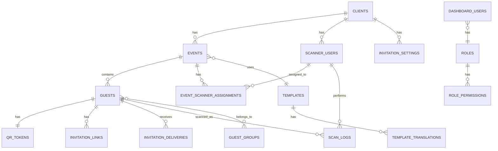

# Phase 2: Backend Architecture & Database Design

## Centralized Digital Invitation & QR Verification Platform

---

## 1. System Architecture Overview

### 1.1 High-Level Architecture

```
┌─────────────────────────────────────────────────────────────────────────────┐
│                              CLIENTS                                        │
├──────────────────────────────────┬──────────────────────────────────────────┤
│      Admin Dashboard (React)     │         Scanner App (Flutter)            │
│      - Super Admin               │         - Scanner Users Only             │
│      - Admin Users               │         - QR Validation                  │
│      - Report Viewers            │         - Offline Support                │
└──────────────────────────────────┴──────────────────────────────────────────┘
                │                                    │
                │ HTTPS                              │ HTTPS
                ▼                                    ▼
┌─────────────────────────────────────────────────────────────────────────────┐
│                           API GATEWAY / LOAD BALANCER                       │
│                    (Rate Limiting, SSL Termination)                         │
└─────────────────────────────────────────────────────────────────────────────┘
                │                                    │
                ▼                                    ▼
┌──────────────────────────────────┐  ┌──────────────────────────────────────┐
│      ADMIN API SERVICE           │  │       SCANNER API SERVICE            │
│      /api/admin/*                │  │       /api/scanner/*                 │
│                                  │  │                                      │
│  - User Management               │  │  - Scanner Authentication            │
│  - Client Management             │  │  - QR Validation                     │
│  - Event Management              │  │  - Scan Logging                      │
│  - Guest Management              │  │  - Event Sync                        │
│  - Template Management           │  │                                      │
│  - Reports & Analytics           │  │                                      │
│  - Settings                      │  │                                      │
└──────────────────────────────────┴──┴──────────────────────────────────────┘
                │                                    │
                └────────────────┬───────────────────┘
                                 ▼
┌─────────────────────────────────────────────────────────────────────────────┐
│                           SHARED SERVICES LAYER                             │
├───────────────────┬───────────────────┬───────────────────┬─────────────────┬───────────────────┤
│  Auth Service     │  Notification     │  File Storage     │  Invitation     │  Queue Service    │
│  (JWT Issuer)     │  (SMS/Email/WA)   │  (Templates/QR)   │  Renderer       │  (Jobs)           │
└───────────────────┴───────────────────┴───────────────────┴─────────────────┴───────────────────┘
                                 │
                                 ▼
┌─────────────────────────────────────────────────────────────────────────────┐
│                              MySQL DATABASE                                 │
│                         (Multi-tenant with client_id)                       │
└─────────────────────────────────────────────────────────────────────────────┘
```

### 1.2 API Separation

| API Group | Base Path | Purpose | Auth Method |
|-----------|-----------|---------|-------------|
| **Admin API** | `/api/admin/*` | Dashboard operations | Dashboard JWT |
| **Scanner API** | `/api/scanner/*` | QR validation only | Scanner JWT |
| **Public API** | `/api/public/*` | Invitation link rendering | Signed URL token |

### 1.3 Security Boundaries

```
┌─────────────────────────────────────────────────────────────────┐
│                    SECURITY BOUNDARY 1                          │
│                  Dashboard Authentication                        │
│     ┌─────────────────────────────────────────────────────┐     │
│     │  Super Admin   │  Admin User   │  Report Viewer     │     │
│     │  (tenant:all)  │ (tenant: *)   │ (read-only)        │     │
│     └─────────────────────────────────────────────────────┘     │
└─────────────────────────────────────────────────────────────────┘

┌─────────────────────────────────────────────────────────────────┐
│                    SECURITY BOUNDARY 2                          │
│                   Scanner Authentication                         │
│     ┌─────────────────────────────────────────────────────┐     │
│     │  Scanner User (scoped to client + assigned events)  │     │
│     └─────────────────────────────────────────────────────┘     │
└─────────────────────────────────────────────────────────────────┘

┌─────────────────────────────────────────────────────────────────┐
│                    SECURITY BOUNDARY 3                          │
│                      Guest Access                                │
│     ┌─────────────────────────────────────────────────────┐     │
│     │  Invitation Link (signed, time-limited, read-only)  │     │
│     └─────────────────────────────────────────────────────┘     │
└─────────────────────────────────────────────────────────────────┘
```

---

## 2. Database Design (Conceptual ERD)

### 2.1 Entity Relationship Diagram



### 2.2 Table Specifications

---

#### `dashboard_users`
> **Purpose:** Admin dashboard users (Super Admin, Admin, Report Viewer)

| Field | Type | Description |
|-------|------|-------------|
| `id` | PK | Unique identifier |
| `email` | UNIQUE | Login email |
| `password_hash` | VARCHAR | Hashed password |
| `name_en` | VARCHAR | Display name (English) |
| `name_ar` | VARCHAR | Display name (Arabic) |
| `role_id` | FK → roles | User role |
| `preferred_language` | ENUM | 'ar', 'en' |
| `status` | ENUM | 'active', 'inactive', 'suspended' |
| `last_login_at` | TIMESTAMP | Last login timestamp |
| `created_at` | TIMESTAMP | Creation date |
| `updated_at` | TIMESTAMP | Last update |

**Relationships:** Many-to-One with `roles`

---

#### `roles`
> **Purpose:** Define dashboard user roles

| Field | Type | Description |
|-------|------|-------------|
| `id` | PK | Unique identifier |
| `name` | VARCHAR | 'super_admin', 'admin', 'report_viewer' |
| `description` | TEXT | Role description |

**Relationships:** One-to-Many with `dashboard_users`, One-to-Many with `role_permissions`

---

#### `role_permissions`
> **Purpose:** Map roles to permission keys

| Field | Type | Description |
|-------|------|-------------|
| `id` | PK | Unique identifier |
| `role_id` | FK → roles | Role reference |
| `permission_key` | VARCHAR | e.g., 'clients.create', 'events.delete' |

---

#### `clients`
> **Purpose:** Business clients (tenants) using the platform

| Field | Type | Description |
|-------|------|-------------|
| `id` | PK | Unique identifier (tenant_id) |
| `name_en` | VARCHAR | Client name (English) |
| `name_ar` | VARCHAR | Client name (Arabic) |
| `contact_email` | VARCHAR | Primary contact |
| `contact_phone` | VARCHAR | Phone number |
| `logo_url` | VARCHAR | Client logo path |
| `subscription_tier` | ENUM | 'basic', 'professional', 'enterprise' |
| `max_events` | INT | Event limit |
| `max_guests_per_event` | INT | Guest limit per event |
| `max_scanner_users` | INT | Scanner user limit |
| `status` | ENUM | 'active', 'inactive', 'suspended' |
| `created_at` | TIMESTAMP | Creation date |
| `updated_at` | TIMESTAMP | Last update |

**Relationships:** One-to-Many with `events`, `scanner_users`, `invitation_settings`

---

#### `events`
> **Purpose:** Events created for clients

| Field | Type | Description |
|-------|------|-------------|
| `id` | PK | Unique identifier |
| `client_id` | FK → clients | **Tenant isolation key** |
| `template_id` | FK → templates | Invitation template |
| `name_en` | VARCHAR | Event name (English) |
| `name_ar` | VARCHAR | Event name (Arabic) |
| `start_datetime` | DATETIME | **Event start (date + time)** |
| `end_datetime` | DATETIME | **Event end (date + time)** |
| `timezone` | VARCHAR | **IANA timezone (e.g., 'Asia/Riyadh')** |
| `venue_en` | TEXT | Venue (English) |
| `venue_ar` | TEXT | Venue (Arabic) |
| `status` | ENUM | 'draft', 'active', 'completed', 'cancelled' |
| `allow_plus_one` | BOOLEAN | Allow companions |
| `max_companions` | INT | Max companions per guest |
| `created_at` | TIMESTAMP | Creation date |
| `updated_at` | TIMESTAMP | Last update |

> [!IMPORTANT]
> **Unified DateTime Model (Locked for Phase 3)**
> - Use `start_datetime` + `end_datetime` instead of separate date/time fields
> - Always store `timezone` for correct local time display
> - Critical for: time-gated widgets, post-event features, QR expiry logic

**Relationships:** Many-to-One with `clients`, Many-to-One with `templates`, One-to-Many with `guests`

---

#### `scanner_users`
> **Purpose:** Mobile app users for scanning QR codes

| Field | Type | Description |
|-------|------|-------------|
| `id` | PK | Unique identifier |
| `client_id` | FK → clients | **Tenant isolation key** |
| `username` | VARCHAR | Login username (unique per client) |
| `password_hash` | VARCHAR | Hashed password |
| `display_name` | VARCHAR | Name shown in app |
| `status` | ENUM | 'active', 'inactive' |
| `last_login_at` | TIMESTAMP | Last app login |
| `last_scan_at` | TIMESTAMP | Last scan performed |
| `device_info` | JSON | Device metadata |
| `created_at` | TIMESTAMP | Creation date |
| `updated_at` | TIMESTAMP | Last update |

**Relationships:** Many-to-One with `clients`, One-to-Many with `event_scanner_assignments`

---

#### `event_scanner_assignments`
> **Purpose:** Assign scanner users to specific events

| Field | Type | Description |
|-------|------|-------------|
| `id` | PK | Unique identifier |
| `event_id` | FK → events | Event reference |
| `scanner_user_id` | FK → scanner_users | Scanner user reference |
| `assigned_at` | TIMESTAMP | Assignment date |

**Unique Constraint:** `(event_id, scanner_user_id)`

---

#### `guests`
> **Purpose:** Invited guests for events

| Field | Type | Description |
|-------|------|-------------|
| `id` | PK | Unique identifier |
| `event_id` | FK → events | **Event scope** |
| `name_en` | VARCHAR | Guest name (English) |
| `name_ar` | VARCHAR | Guest name (Arabic) |
| `phone` | VARCHAR | Phone number |
| `email` | VARCHAR | Email address |
| `companions_allowed` | INT | Number of plus-ones |
| `companions_confirmed` | INT | Confirmed companions |
| `invitation_status` | ENUM | 'pending', 'sent', 'delivered', 'opened', 'clicked' |
| `check_in_status` | ENUM | 'not_checked_in', 'checked_in' |
| `checked_in_at` | TIMESTAMP | Check-in time |
| `checked_in_by` | FK → scanner_users | Who scanned |
| `group_id` | FK → guest_groups | Guest category |
| `notes` | TEXT | Internal notes |
| `created_at` | TIMESTAMP | Creation date |
| `updated_at` | TIMESTAMP | Last update |

**Relationships:** Many-to-One with `events`, One-to-One with `qr_tokens`, One-to-Many with `scan_logs`

---

#### `guest_groups`
> **Purpose:** Categorize guests (VIP, Family, etc.)

| Field | Type | Description |
|-------|------|-------------|
| `id` | PK | Unique identifier |
| `event_id` | FK → events | Event scope |
| `name_en` | VARCHAR | Group name (English) |
| `name_ar` | VARCHAR | Group name (Arabic) |
| `color` | VARCHAR | Display color (hex) |

---

#### `qr_tokens`
> **Purpose:** Unique QR codes for each guest

| Field | Type | Description |
|-------|------|-------------|
| `id` | PK | Unique identifier |
| `guest_id` | FK → guests | One-to-one with guest |
| `token` | VARCHAR(64) | **Unique, cryptographically random** |
| `qr_image_url` | VARCHAR | Generated QR image path |
| `is_valid` | BOOLEAN | Can be invalidated manually |
| `created_at` | TIMESTAMP | Generation time |

**Unique Constraint:** `token`

---

#### `invitation_links`
> **Purpose:** Shareable links sent to guests

| Field | Type | Description |
|-------|------|-------------|
| `id` | PK | Unique identifier |
| `guest_id` | FK → guests | Guest reference |
| `link_token` | VARCHAR(64) | Unique link identifier |
| `short_url` | VARCHAR | Shortened URL |
| `expires_at` | TIMESTAMP | Link expiration |
| `created_at` | TIMESTAMP | Creation time |

---

#### `invitation_deliveries`
> **Purpose:** Track invitation delivery per channel

| Field | Type | Description |
|-------|------|-------------|
| `id` | PK | Unique identifier |
| `guest_id` | FK → guests | Guest reference |
| `channel` | ENUM | 'sms', 'email', 'whatsapp' |
| `status` | ENUM | 'pending', 'sent', 'delivered', 'failed' |
| `sent_at` | TIMESTAMP | When sent |
| `delivered_at` | TIMESTAMP | Delivery confirmation |
| `error_message` | TEXT | If failed |

---

#### `scan_logs`
> **Purpose:** Audit trail of all QR scans

| Field | Type | Description |
|-------|------|-------------|
| `id` | PK | Unique identifier |
| `qr_token` | VARCHAR | Scanned token value |
| `guest_id` | FK → guests | Resolved guest (if valid) |
| `event_id` | FK → events | Event context |
| `scanner_user_id` | FK → scanner_users | Who scanned |
| `scan_result` | ENUM | 'valid', 'invalid', 'duplicate', 'expired', 'wrong_event' |
| `scanned_at` | TIMESTAMP | Scan timestamp |
| `device_info` | JSON | Scanner device metadata |
| `location_lat` | DECIMAL | GPS latitude (optional) |
| `location_lng` | DECIMAL | GPS longitude (optional) |

---

#### `templates`
> **Purpose:** Invitation card templates

| Field | Type | Description |
|-------|------|-------------|
| `id` | PK | Unique identifier |
| `name` | VARCHAR | Template name |
| `category` | ENUM | 'wedding', 'corporate', 'birthday', 'general' |
| `thumbnail_url` | VARCHAR | Preview image |
| `design_data` | JSON | Template structure (future) |
| `is_active` | BOOLEAN | Available for use |
| `created_at` | TIMESTAMP | Creation date |

---

#### `template_translations`
> **Purpose:** Language variants for templates

| Field | Type | Description |
|-------|------|-------------|
| `id` | PK | Unique identifier |
| `template_id` | FK → templates | Template reference |
| `language` | ENUM | 'ar', 'en' |
| `content_data` | JSON | Translated text elements |

---

#### `invitation_settings`
> **Purpose:** Client-level delivery settings (with event-level override support)

| Field | Type | Description |
|-------|------|-------------|
| `id` | PK | Unique identifier |
| `client_id` | FK → clients | Client reference |
| `event_id` | FK → events | **NULL = client default, set = event override** |
| `sms_enabled` | BOOLEAN | SMS channel active |
| `email_enabled` | BOOLEAN | Email channel active |
| `whatsapp_enabled` | BOOLEAN | WhatsApp channel active |
| `sms_sender_id` | VARCHAR | SMS sender name |
| `email_sender_name` | VARCHAR | Email from name |
| `email_sender_address` | VARCHAR | Email from address |

> [!NOTE]
> **Settings Scope Resolution (Phase 3)**
> 1. Check for event-specific settings (`event_id` = target event)
> 2. Fall back to client defaults (`event_id` IS NULL)
> This allows stricter rules per event without schema changes.

---

#### `activity_logs`
> **Purpose:** Audit log for dashboard actions

| Field | Type | Description |
|-------|------|-------------|
| `id` | PK | Unique identifier |
| `user_id` | FK → dashboard_users | Who performed action |
| `action` | VARCHAR | 'create', 'update', 'delete', 'login' |
| `entity_type` | VARCHAR | 'client', 'event', 'guest', etc. |
| `entity_id` | INT | Affected record ID |
| `old_values` | JSON | Previous state |
| `new_values` | JSON | New state |
| `ip_address` | VARCHAR | Request IP |
| `created_at` | TIMESTAMP | Action time |

---

## 3. Authentication & Authorization Model

### 3.1 Dashboard User Authentication

```
┌─────────────────────────────────────────────────────────────────┐
│                  DASHBOARD AUTH FLOW                            │
└─────────────────────────────────────────────────────────────────┘

1. User submits email + password
              ↓
2. Server validates credentials against dashboard_users
              ↓
3. If valid → Generate JWT with claims:
   {
     user_id: 123,
     role: "admin",
     permissions: ["clients.view", "events.create", ...],
     tenant_scope: "all" | [client_ids]
   }
              ↓
4. Return access_token (short-lived) + refresh_token (long-lived)
              ↓
5. Client stores tokens, sends access_token in Authorization header
              ↓
6. On expiry → Use refresh_token to get new access_token
```

### 3.2 Scanner User Authentication

```
┌─────────────────────────────────────────────────────────────────┐
│                  SCANNER AUTH FLOW                              │
└─────────────────────────────────────────────────────────────────┘

1. Scanner user enters username + password in Flutter app
              ↓
2. Server validates against scanner_users (scoped by client)
              ↓
3. If valid → Generate Scanner JWT with claims:
   {
     scanner_user_id: 456,
     client_id: 10,
     assigned_event_ids: [101, 102, 103]
   }
              ↓
4. Return access_token + list of assigned events for offline cache
              ↓
5. App caches event/guest data for offline scanning
              ↓
6. Token used for all scan API calls
```

### 3.3 Role-Based Access Enforcement

| Role | Permissions | Tenant Scope |
|------|-------------|--------------|
| **Super Admin** | All permissions | All clients (global) |
| **Admin User** | CRUD on operational entities | All clients or assigned subset |
| **Report Viewer** | Read-only on reports/logs | All clients or assigned subset |

**Permission Check Flow:**
```
Request arrives → Extract JWT → Validate token
        ↓
Check: user.permissions.includes(required_permission)
        ↓
Check: requested_resource.client_id IN user.tenant_scope
        ↓
If Super Admin → Bypass tenant check
        ↓
Allow or Deny
```

### 3.4 Client/Event Isolation Logic

| User Type | Isolation Rule |
|-----------|----------------|
| **Dashboard User** | WHERE client_id IN (user.tenant_scope) |
| **Scanner User** | WHERE event_id IN (assigned_event_ids) AND client_id = scanner.client_id |
| **Guest (public)** | Only sees own invitation via signed link |

---

## 4. Invitation & QR Logic (Conceptual)

### 4.1 Invitation Link Generation

```
Guest Created
      ↓
System generates unique link_token (32-char random string)
      ↓
Create invitation_links record:
  - guest_id
  - link_token
  - expires_at = event_date + 24 hours
      ↓
Generate short_url: https://invite.domain/{link_token}
      ↓
Link ready for delivery via SMS/Email/WhatsApp
```

**Link Resolution Flow:**
```
Guest clicks link → Server validates link_token
      ↓
If valid and not expired → Load guest + event + template
      ↓
Render personalized invitation page (AR or EN based on preference)
      ↓
Track: Update invitation_status = 'clicked'
```

### 4.2 QR Token Generation

```
Guest Created
      ↓
System generates unique QR token (64-char cryptographically random)
      ↓
Create qr_tokens record:
  - guest_id
  - token
  - is_valid = true
      ↓
Generate QR code image from token
      ↓
Store qr_image_url
      ↓
Embed QR in invitation template
```

### 4.3 QR Validation Flow

```
Scanner App scans QR code
      ↓
Extract token from QR data
      ↓
Send POST /api/scanner/validate { token, event_id }
      ↓
Server performs validation:

1. Find qr_tokens WHERE token = scanned_token
   └─ Not found → Result: INVALID

2. Check qr_tokens.is_valid = true
   └─ False → Result: INVALID (manually revoked)

3. Find guest via qr_tokens.guest_id

4. Check guest.event_id = scanner's current event
   └─ Mismatch → Result: WRONG_EVENT

5. Check guest.check_in_status
   └─ Already 'checked_in' → Result: DUPLICATE

6. All checks pass:
   └─ Update guest.check_in_status = 'checked_in'
   └─ Update guest.checked_in_at = NOW()
   └─ Update guest.checked_in_by = scanner_user_id
   └─ Result: VALID
      ↓
Log scan in scan_logs with result
      ↓
Return response to app with guest details + result
```

### 4.4 Duplicate Scan Prevention

| Strategy | Implementation |
|----------|----------------|
| **Database Check** | Check `guest.check_in_status` before marking as checked-in |
| **Result Type** | Return `DUPLICATE` if already checked in |
| **Grace Period** | Optional: Allow re-scan within 30 seconds (same scanner, same guest) |
| **Log All Scans** | Every scan logged regardless of result for audit |

### 4.5 Scan Result Types

| Result | Meaning |
|--------|---------|
| `VALID` | First valid check-in, guest now marked as checked |
| `INVALID` | Token not found or revoked |
| `DUPLICATE` | Guest already checked in |
| `EXPIRED` | Event has ended |
| `WRONG_EVENT` | Token belongs to different event |

---

## 5. Data Ownership & Isolation

### 5.1 Multi-Tenant Isolation Model

```
┌─────────────────────────────────────────────────────────────────┐
│                    TENANT ISOLATION LAYERS                      │
└─────────────────────────────────────────────────────────────────┘

Layer 1: Application-Level Filtering
┌─────────────────────────────────────────────────────────────────┐
│  Every query includes: WHERE client_id = @current_client_id    │
└─────────────────────────────────────────────────────────────────┘

Layer 2: API-Level Authorization
┌─────────────────────────────────────────────────────────────────┐
│  Middleware validates: requested resource ∈ user's scope       │
└─────────────────────────────────────────────────────────────────┘

Layer 3: Row-Level Ownership
┌─────────────────────────────────────────────────────────────────┐
│  All tenant data has client_id or event_id FK                  │
└─────────────────────────────────────────────────────────────────┘
```

### 5.2 Isolation by User Type

#### Dashboard Users

| Role | Data Access |
|------|-------------|
| **Super Admin** | All clients, all events, all data |
| **Admin/Viewer** | Only clients in their `tenant_scope` array |

**Query Pattern:**
```
IF user.role = 'super_admin':
    SELECT * FROM events
ELSE:
    SELECT * FROM events WHERE client_id IN (user.tenant_scope)
```

#### Scanner Users

| Constraint | Enforcement |
|------------|-------------|
| **Client Scope** | Can only see events from their `client_id` |
| **Event Scope** | Can only scan for events in `event_scanner_assignments` |
| **Data Access** | Read-only for event/guest data, write for scan_logs |

**Query Pattern:**
```
SELECT guests.* FROM guests
JOIN events ON guests.event_id = events.id
WHERE events.client_id = @scanner_client_id
  AND events.id IN (SELECT event_id FROM event_scanner_assignments 
                    WHERE scanner_user_id = @scanner_user_id)
```

### 5.3 Super Admin Bypass

| Scenario | Behavior |
|----------|----------|
| **View All Clients** | No client_id filter applied |
| **Impersonate Client** | Optional: View as specific client for testing |
| **Cross-Client Reports** | Aggregate data across all tenants |
| **System Settings** | Access to global configuration |

### 5.4 Isolation Summary Table

| Entity | Owned By | Isolation Key |
|--------|----------|---------------|
| `events` | Client | `client_id` |
| `guests` | Event | `event_id` → `client_id` |
| `qr_tokens` | Guest | `guest_id` → `event_id` → `client_id` |
| `scan_logs` | Event | `event_id` → `client_id` |
| `scanner_users` | Client | `client_id` |
| `invitation_settings` | Client | `client_id` |
| `templates` | System | Global (no tenant isolation) |
| `dashboard_users` | System | Global (role controls access) |

---

## 6. Key Design Decisions

| Decision | Rationale |
|----------|-----------|
| **Separate user tables** | Dashboard and scanner users have different auth flows, permissions, and lifecycles |
| **Event-scoped guests** | All guest data belongs to exactly one event; no sharing |
| **Token-based QR** | Random tokens are more secure than predictable IDs |
| **Soft delete** | Use `status` fields instead of hard delete for audit trail |
| **JSON for flexible data** | Device info, template content use JSON for schema flexibility |
| **Arabic-first naming** | Dual name fields (name_ar, name_en) for proper bilingual support |

---

*Document Version: 1.1*  
*Created: 2026-01-18*  
*Updated: 2026-01-18 – Unified datetime model, invitation settings scope, render engine*  
*Relates To: Phase 1 (implementation_plan.md)*

---

## 7. Phase 3 Locked Rules

> [!CAUTION]
> The following rules are **locked** and must be followed in Phase 3 (Flutter Scanner App) and beyond.

### 7.1 Event Time Model
| Rule | Requirement |
|------|-------------|
| **Unified Datetime** | Use `start_datetime` + `end_datetime` (no separate date/time) |
| **Timezone Required** | Every event must have IANA timezone stored |
| **Time-Aware Logic** | All time-gated features must convert to event's local timezone |

### 7.2 Invitation Settings Scope
| Rule | Requirement |
|------|-------------|
| **Client Defaults** | `invitation_settings` with `event_id = NULL` |
| **Event Overrides** | `invitation_settings` with specific `event_id` |
| **Resolution Order** | Event-specific → Client default |

### 7.3 Public Invitation Renderer
| Rule | Requirement |
|------|-------------|
| **Named Service** | Must be explicitly named as "Invitation Renderer" |
| **Inputs** | Template + Guest + Event + Time-based rules |
| **Outputs** | Rendered HTML/image with QR, personalization, time-gated widgets |
| **Phase 3 Scope** | Define interface; implementation in Phase 4 |
